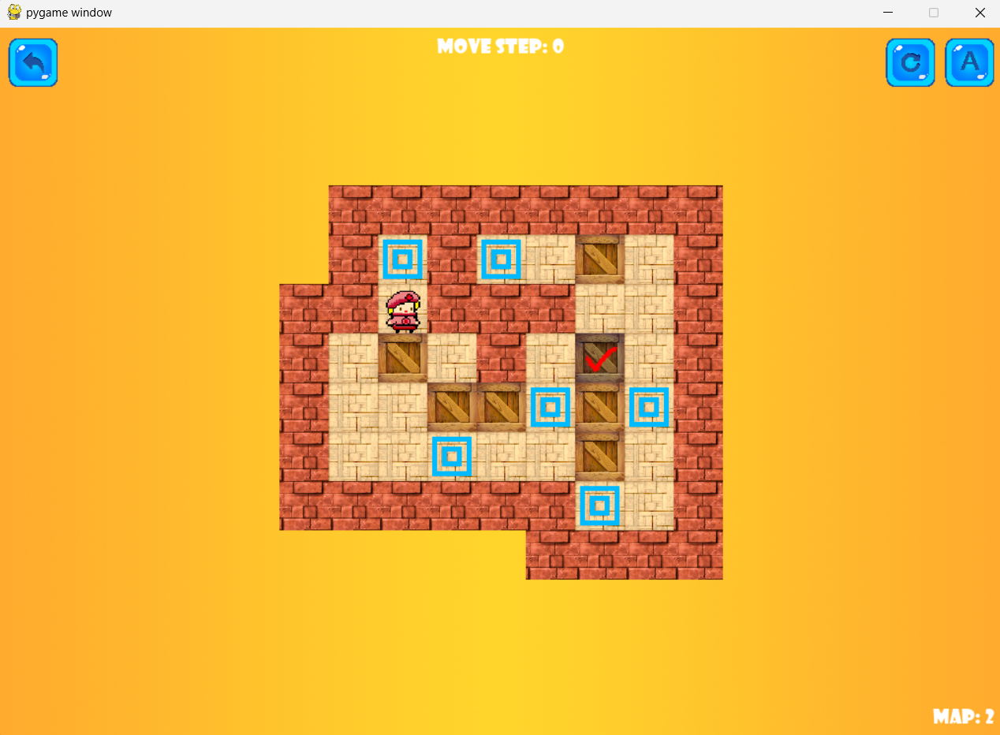

# Sokoban Game in Python

### Description
Sokoban is a classic Japanese transport puzzle game where the player pushes boxes or crates around in a warehouse, trying to get them to storage locations. The name “Sokoban” means “warehouse keeper” in Japanese.

### This implementation is based on Python and the Pygame library.
### System Requirements
- Python 2.7 or later
- Pygame 1.9 or later
### How to Play
- Use arrow keys to move the player.
- Press N to next map.
- Press P to prevprevious map.
- Press ESC to exit the game.

### Level Sets
- There were 75 levels in the game. You can also make your own map.

### Screenshots
- 

Good Luck! 🎮📦🔥